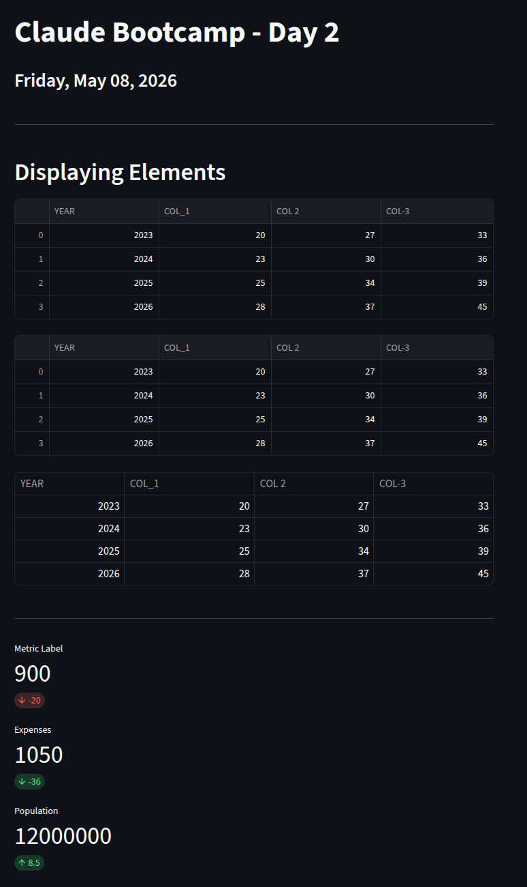
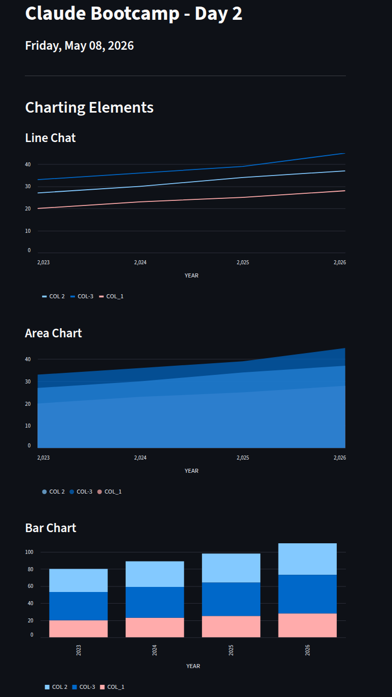
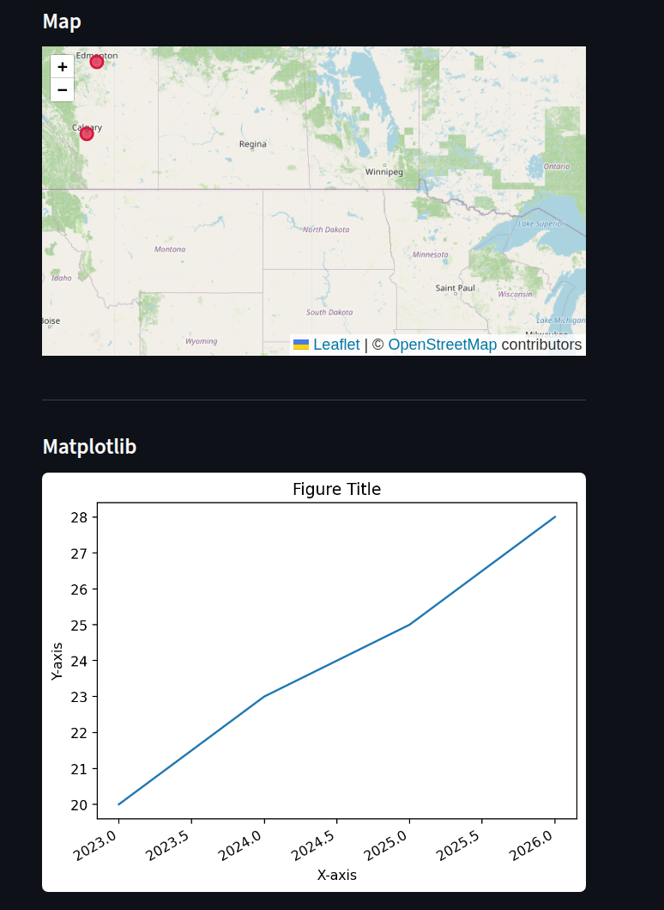

# STREAMLIT PROGRESS *(Spring 1 - Week 1)*

<br><br>

## Thursday, May 07, 2026
1. Today I have learned hot to `display elements`.
```Python
import pandas as pd
import streamlit as st

df = pd.read_csv("data/sample.csv", dtype="int")

# -------------------------------------------------------------
st.title("Claude Bootcamp - Day 2")
st.subheader("Friday, May 08, 2026")
st.divider()

st.header("Displaying Elements")


# -------------------------------------------------------------
# Displaying a DataFrame
# Show DataFrame - Method 1
st.dataframe(df)

# Show DataFrame - Method 2
st.write(df)

# Show DataFrame - Method 3 (static table)
st.table(df)
st.divider()


# -------------------------------------------------------------
# Displaying Metrics
st.metric(label="Metric Label", value=900, delta=-20, delta_color="normal")

st.metric(label="Expenses", value=1050, delta=-36, delta_color="inverse")

st.metric(label="Population", value=12000000, delta=8.5, delta_color="green")

```

---

<br>

2. I also have learned how to `chart elements`.
```Python

import pandas as pd
import streamlit as st

# ------------------------------------------------------
st.title("Claude Bootcamp - Day 2")
st.subheader("Friday, May 08, 2026")
st.divider()
st.header("Charting Elements")

# ------------------------------------------------------------------------------------
# Datasets of the file
df1 = pd.read_csv("data/sample.csv")
df2 = pd.read_csv("data/sample_map.csv")

# ------------------------------------------------------------------------------------
# Streamlit line plot
st.subheader("Line Chat")
st.line_chart(df1, x="YEAR", y=["COL_1", "COL 2", "COL-3"])

# Streamlit area chart
st.subheader("Area Chart")
st.area_chart(df1, x="YEAR", y=["COL_1", "COL 2", "COL-3"])

# Streamlit bar chart
st.subheader("Bar Chart")
st.bar_chart(df1, x="YEAR", y=["COL_1", "COL 2", "COL-3"])

# ------------------------------------------------------------------------------------
# Streamlit map
# st.map(df2)
# st.map(df2, width="stretch")

import folium
from streamlit_folium import st_folium

st.divider()
st.subheader("Map")

m = folium.Map(location=[df2["latitude"].mean(), df2["longitude"].mean()], zoom_start=5)

for _, row in df2.iterrows():
    folium.CircleMarker(
        location=[row["latitude"], row["longitude"]],
        radius=8,
        color="crimson",
        fill=True,
        fill_opacity=0.7,
    ).add_to(m)

st_folium(m, use_container_width=True, height=400)


# ------------------------------------------------------------------------------------
# Matplotlib
import matplotlib.pyplot as plt

st.divider()
st.subheader("Matplotlib")

fig, ax = plt.subplots()
ax.plot(df1["YEAR"], df1["COL_1"])
ax.set_title("Figure Title")
ax.set_xlabel("X-axis")
ax.set_ylabel("Y-axis")
fig.autofmt_xdate()

st.pyplot(fig)
# ------------------------------------------------------------------------------------
```


**NOTA:** Hoy tuve problemas al utilizar el método `st.map(df2)`, ya por mas que no producía errores, no se podrían ver las imagenes de los mapas
Por esta razon tuve que instalar **folium**, que utiliza tiles de *OpenStreetMap* completamente gratuitos, sin tokens, sin límites.

```bash
pip install folium streamlit-folium
```


---
