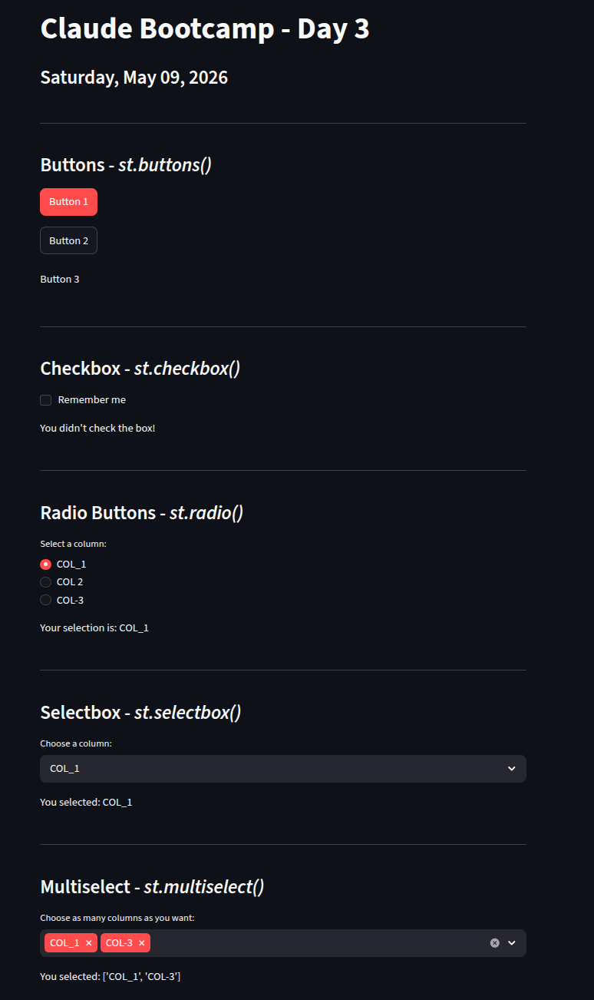
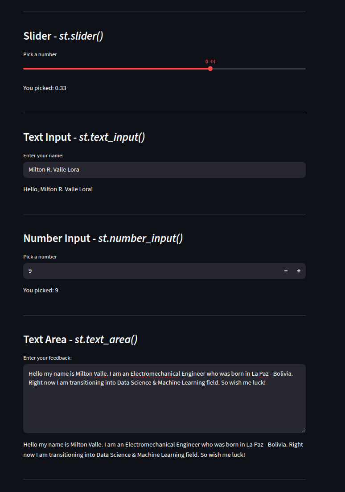
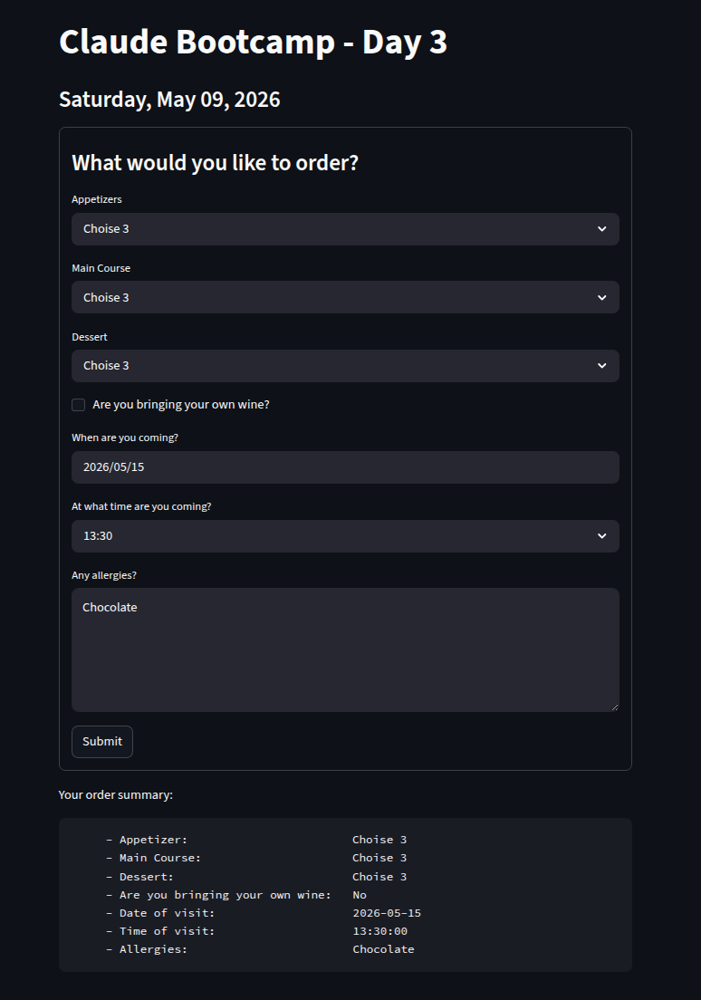
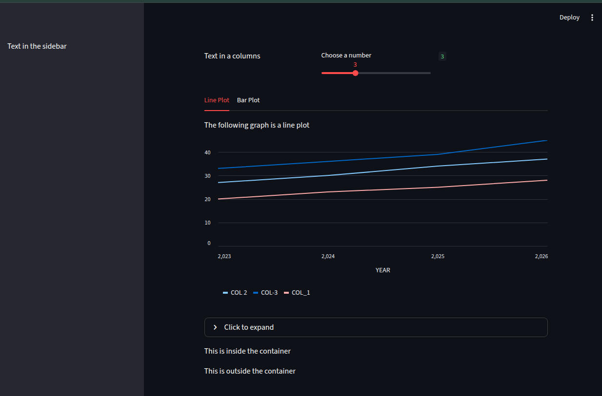

# STREAMLIT PROGRESS *(Spring 1 - Day 3)*

<br><br>

## Saturday, May 09, 2026
<br>

Today I have learned how to:
1. `Input Widgets`.
2. `Create Forms`.
3. `Customize Layouts`.

## Input Widgets

```Python
import pandas as pd
import streamlit as st

# ------------------------------------------------------
st.title("Claude Bootcamp - Day 3")
st.subheader("Saturday, May 09, 2026")
st.divider()

# ----------------------------------------------------------------------------------
# Here is were we introduce interactivity on Streamlit. (PART I)
# ----------------------------------------------------------------------------------
# Buttons
st.markdown("### Buttons - *st.buttons()*")
primary_btn = st.button(label="Button 1", type="primary")
secondary_btn = st.button(label="Button 2", type="secondary")
tertiary_btn = st.button(label="Button 3", type="tertiary")

if primary_btn:
    st.header("You clicked the primary button!")
if secondary_btn:
    st.subheader("You clicked the secondary button!")
if tertiary_btn:
    st.markdown("#### You clicked the tertiary button!")
st.divider()


# ----------------------------------------------------------------------------------
# Checkbox
st.markdown("### Checkbox - *st.checkbox()*")
checkbox = st.checkbox(label="Remember me")
if checkbox:
    st.write("You checked the box!")
else:
    st.write("You didn't check the box!")
st.divider()


# ----------------------------------------------------------------------------------
# Radio Buttons
st.markdown("### Radio Buttons - *st.radio()*")
df = pd.read_csv("data/sample.csv")

radio_btn = st.radio(
    label="Select a column:", options=df.columns[1:], index=0, horizontal=False
)
st.write(f"Your selection is: {radio_btn}")
st.divider()


# ----------------------------------------------------------------------------------
# Selectbox
st.markdown("### Selectbox - *st.selectbox()*")
select = st.selectbox(label="Choose a column:", options=df.columns[1:], index=0)
st.write(f"You selected: {select}")
st.divider()

# ----------------------------------------------------------------------------------
# Here is were we introduce interactivity on Streamlit. (PART II)
# ----------------------------------------------------------------------------------
# Multiselect
st.markdown("### Multiselect - *st.multiselect()*")
multiselect = st.multiselect(
    label="Choose as many columns as you want:",
    options=df.columns[1:],
    default=["COL_1"],
    max_selections=3,
)
st.write(f"You selected: {multiselect}")
st.divider()

# ----------------------------------------------------------------------------------
# Slider
st.markdown("### Slider - *st.slider()*")
slider = st.slider(
    label="Pick a number", min_value=-1.00, max_value=1.00, value=0.00, step=0.01
)
st.write(f"You picked: {slider:.2f}")
st.divider()

# ----------------------------------------------------------------------------------
# Text Input
st.markdown("### Text Input - *st.text_input()*")
text_input = st.text_input(label="Enter your name:", placeholder="Milo Casazola")
st.write(f"Hello, {text_input}!")
st.divider()

# ----------------------------------------------------------------------------------
# Number Input
st.markdown("### Number Input - *st.number_input()*")
num_input = st.number_input("Pick a number", min_value=0, max_value=10, value=0, step=1)
st.write(f"You picked: {num_input}")
st.divider()

# ----------------------------------------------------------------------------------
# Text Area
st.markdown("### Text Area - *st.text_area()*")
txt_area = st.text_area(
    label="Enter your feedback:", height=200, placeholder="Type your feedback here..."
)
st.write(txt_area)
st.divider()

```




<br>

## Create Forms

```Python
import streamlit as st

# # ------------------------------------------------------
st.title("Claude Bootcamp - Day 3")
st.subheader("Saturday, May 09, 2026")


# ----------------------------------------------------------------------------------
with st.form("form_key"):
    st.markdown("### What would you like to order?")

    appetizers = st.selectbox(
        label="Appetizers", options=["Choise 1", "Choise 2", "Choise 3"], index=0
    )
    main = st.selectbox(
        label="Main Course", options=["Choise 1", "Choise 2", "Choise 3"], index=1
    )
    dessert = st.selectbox(
        label="Dessert", options=["Choise 1", "Choise 2", "Choise 3"], index=2
    )

    wine = st.checkbox(label="Are you bringing your own wine?")

    visit_date = st.date_input(label="When are you coming?")
    visit_time = st.time_input(label="At what time are you coming?")

    allergies = st.text_area(
        label="Any allergies?", height=180, placeholder="Leave us a note for allergies"
    )

    submit_btn = st.form_submit_button(label="Submit")
# ----------------------------------------------------------------------------------
st.write(f"""Your order summary:

         - Appetizer: {appetizers:>31}
         - Main Course: {main:>29}
         - Dessert: {dessert:>33}
         - Are you bringing your own wine:\t{"Yes" if wine else "No"}
         - Date of visit:\t\t\t{visit_date}
         - Time of visit:\t\t\t{visit_time}
         - Allergies:\t\t\t\t{allergies}
         """)
# ----------------------------------------------------------------------------------

```



<br>

## Customize Layouts
```Python
import streamlit as st

# ---------------------------------------------------------------------
# Sidebar
with st.sidebar:
    st.write("Text in the sidebar")


# ---------------------------------------------------------------------
# Columns
col1, col2, col3 = st.columns(3)

col1.write("Text in a columns")
slider = col2.slider("Choose a number", min_value=0, max_value=10, value=5, step=1)
col3.write(slider)


# ---------------------------------------------------------------------
# Tabs
import pandas as pd

df = pd.read_csv("data/sample.csv")

tab1, tab2 = st.tabs(["Line Plot", "Bar Plot"])

with tab1:
    tab1.write("The following graph is a line plot")
    st.line_chart(df, x="YEAR", y=["COL_1", "COL 2", "COL-3"])

with tab2:
    tab2.write("The following graph is a bar plot")
    st.bar_chart(df, x="YEAR", y=["COL_1", "COL 2", "COL-3"])


# ---------------------------------------------------------------------
# Expander (collapsible element)
with st.expander("Click to expand"):
    st.write("This is a text that you only see when you expand.")


# ---------------------------------------------------------------------
# Container (group elements together)
with st.container():
    st.write("This is inside the container")

st.write("This is outside the container")

```

